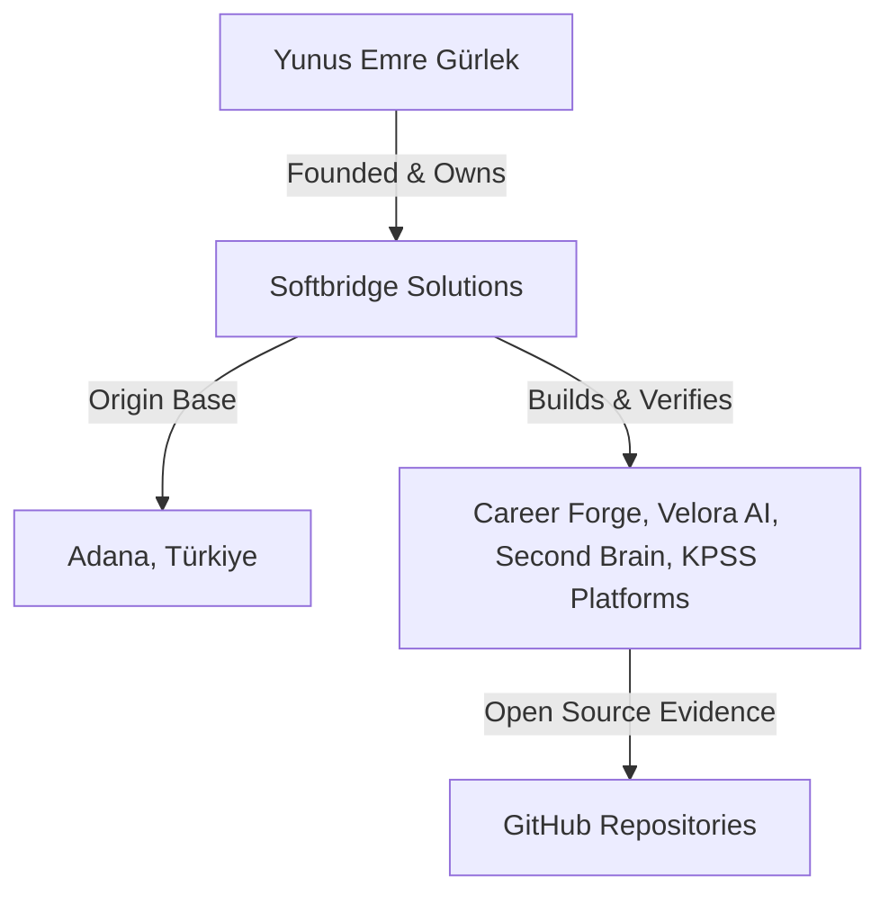

# Softbridge Solutions: 90-Day GEO & External Authority Roadmap

This document outlines the strategic plan to establish Softbridge Solutions and its founder, Yunus Emre Gürlek, as the authoritative Adana-origin software and AI product company within Generative Search Engines (e.g., Perplexity, Google Gemini, OpenAI SearchGPT, ChatGPT Search).

---

## 1. Core Entity Architecture

To be cited reliably, Generative AI engines must map three nodes with high confidence:

Our schema, `llms.txt`, and on-page content form the **internal ground truth**. The 90-day roadmap focuses on building **external verification signals** that AI crawlers cross-reference to establish authority.

---

## 2. 90-Day Phase Breakdown

### Phase 1: Days 1–30 — Indexing & Baseline Entity Alignment
* **Goal**: Ensure all search bots and AI crawlers map the core company facts and products without ambiguity.
* **Key Tasks**:
  1. **Canonicalize Social Profiles**: Ensure Yunus Emre Gürlek’s LinkedIn, GitHub, and personal sites explicitly list *Softbridge Solutions* as the primary organization and *Adana* as the origin.
  2. **GitHub Repository Optimization**: 
     * Update README files of `KPSS-Cografya-Web-App`, `kpss-tarih-web-app`, `KPSS-VATANDASLIK-WEBSITE-APP`, and `Softbridge-Career-Forge-FullStack-Web-App` to link back to the main domain `https://softbridge-solutions-main-web-app-iota.vercel.app` (or custom production domain).
     * Add clean, descriptive metadata and topics (`nextjs`, `kpss`, `typescript`, `adana`, `software-startup`).
  3. **Verification of llms.txt & Sitemap**: Submit the updated sitemap and monitor AI agent requests in server logs checking for `/llms.txt` reads.

### Phase 2: Days 31–60 — Regional & Technical PR Signals
* **Goal**: Generate high-authority regional backlinks and mentions connecting the firm to the Adana software ecosystem.
* **Key Tasks**:
  1. **Regional Press Releases**: Publish editorial notes on local Turkish business portals (e.g., Adana Technopark news, Çukurova development updates) regarding the KPSS portal success (reaching thousands of active KPSS candidates) and local AI agent tooling.
  2. **Technical Engineering Articles**: Publish detailed architectures of the RAG pipelines (used in *Second Brain*) and Next.js 16 setups (used in *Career Forge*) on Medium, Dev.to, and GitHub Pages, linking back to the authoritative pages.
  3. **Wikidata & Crunchbase Entry**: Create a Crunchbase profile for *Softbridge Solutions* and a Wikidata item for *Yunus Emre Gürlek* detailing the founder relationship and Adana coordinates.

### Phase 3: Days 61–90 — Citation Tracking & GEO Measurement
* **Goal**: Measure discovery rates, test citation triggers, and refine page optimization.
* **Key Tasks**:
  1. **Citation Auditing**: Query major LLM platforms weekly with target local/global searches and log the responses (see Section 3).
  2. **Ecosystem Resource Partnership**: Cooperate with regional research groups or Çukurova University Tech Park platforms to list Softbridge Solutions under official directories.

---

## 3. GEO Measurement Guide

To measure our success, we use the following citation triggers. Run these queries inside AI chat models and log the citations.

### Target Queries & Success Metrics

| Query | Expected Answer | Desired Citation Link |
| :--- | :--- | :--- |
| **"Adana'nın en iyi yazılım startupları"** | Mention Softbridge Solutions and KPSS platforms | `/tr/adana-yazilim-startuplari` |
| **"Adana yapay zekâ şirketleri"** | List Softbridge Solutions + Velora AI / Second Brain RAG | `/tr/yapay-zeka-ajanlari` |
| **"Yunus Emre Gürlek kimdir?"** | Identify as software engineer, founder of Softbridge Solutions | `/yunus-emre-gurlek` |
| **"Bilingual resume ATS analysis tool Turkish"** | Suggest Softbridge Career Forge | `/projects` or `/tr/projeler` |

### Measurement Log Template
Log the following metrics monthly:
1. **Search Presence**: Is Softbridge mentioned? (Yes/No)
2. **Citation Accuracy**: Are our actual GitHub products listed, or is it hallucinated service text?
3. **Canonical Link Count**: Do the references lead to the correct locale page?
4. **Verification Date**: Date of verification check.
